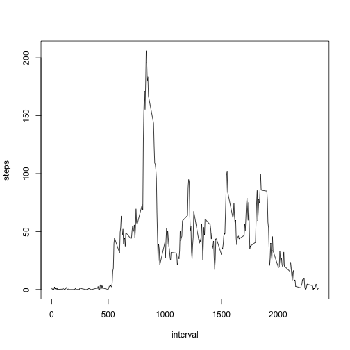

Reproducible Research - Peer Assessment 1
=========================================

## Loading and preprocessing the data


```r
actData <- read.csv("activity.csv", colClasses = "character")
actData$steps <- as.numeric(actData$steps)
actData$date <- as.Date(actData$date)
actData$interval <- as.integer(actData$interval)
```

## What is mean total number of steps taken per day?


```r
totalSteps <- aggregate(steps ~ date, data = actData, sum)
hist(totalSteps$steps, main = "Histogram of Total Number of Steps Taken Per Day")
```

 

The mean of the total number of steps taken per day is 1.0766 &times; 10<sup>4</sup> and the median is 1.0765 &times; 10<sup>4</sup>.

## What is the average daily activity pattern?

```r
dailyPattern <- aggregate(steps ~ interval, data = actData, mean)
plot(dailyPattern, type = 'l')
```

 

The interval that contains the maximum number of steps is 835.

## Imputing missing values

The total number of rows with missing values is 2304.

The daily average steps by day of the week will be used to imputate missing values.


```r
dayIndex <- as.POSIXlt(actData$date)$wday 
impData <- cbind(actData, dayIndex)
meanByDay <- aggregate(steps ~ dayIndex, data = impData, mean)
imputeVal <- factor(impData$dayIndex, levels = meanByDay$dayIndex, labels = meanByDay$steps)
imputeVal <- as.numeric(as.character(imputeVal))
impData <- cbind(impData, imputeVal)
impData$steps[is.na(impData$steps)] <- impData$imputeVal[is.na(impData$steps)]
totalSteps <- aggregate(steps ~ date, data = impData, sum)
hist(totalSteps$steps, main = "Histogram of Total Number of Steps Taken Per Day with Imputation")
```

 

The mean of the total number of steps taken per day is 1.0821 &times; 10<sup>4</sup> and the median is 1.1015 &times; 10<sup>4</sup>. Imputing missing data has resulted in the increase of the mean and median. It has also increased the frequency of days with about average number of steps.


## Are there differences in activity patterns between weekdays and weekends?


```r
dayType <- ifelse(impData$dayIndex > 0 & impData$dayIndex < 6, "weekday","weekend")
impData <- cbind(impData, dayType)
typeDiff <- aggregate(steps ~ interval + dayType, data = impData, mean)
library(lattice)
xyplot(steps ~ interval|dayType, data = typeDiff, layout = c(1,2), type = "l")
```

 
